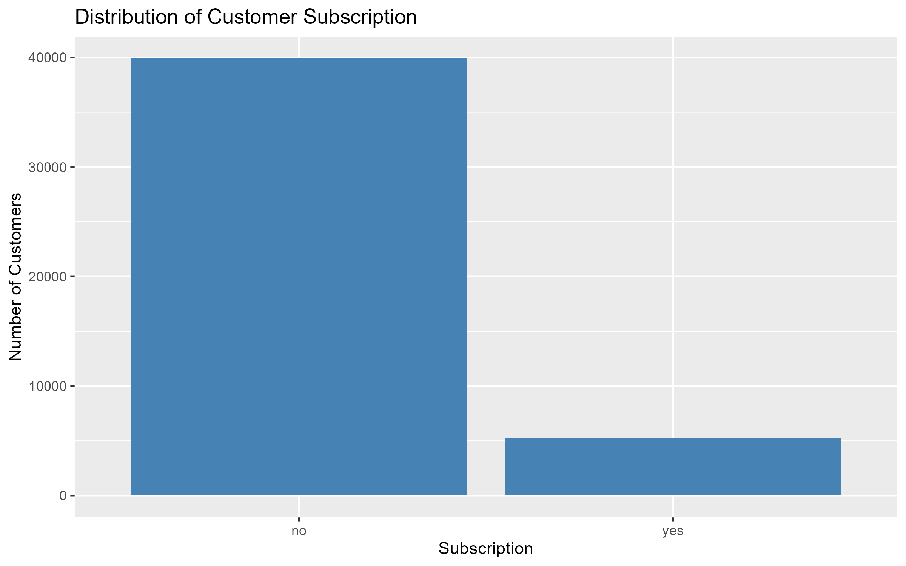
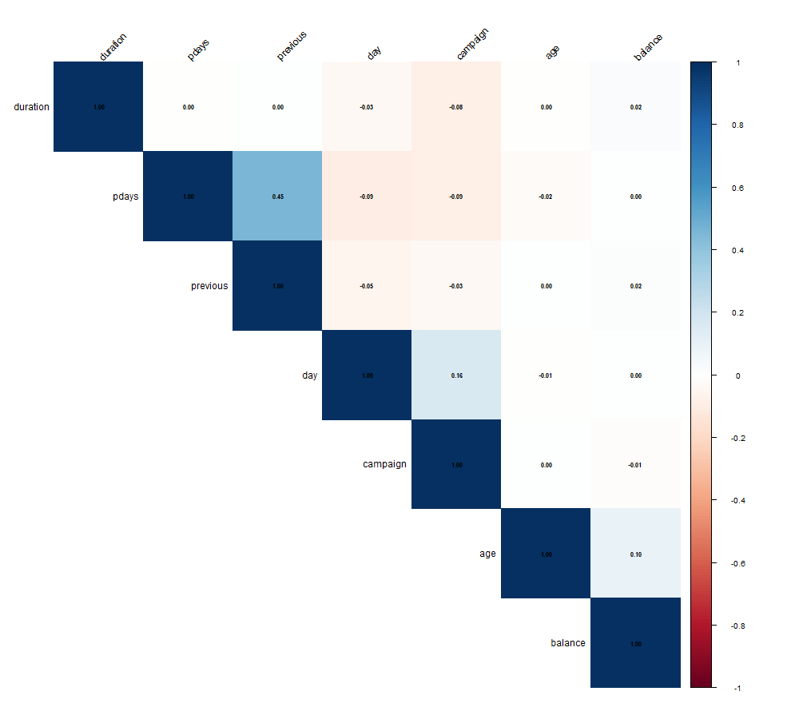
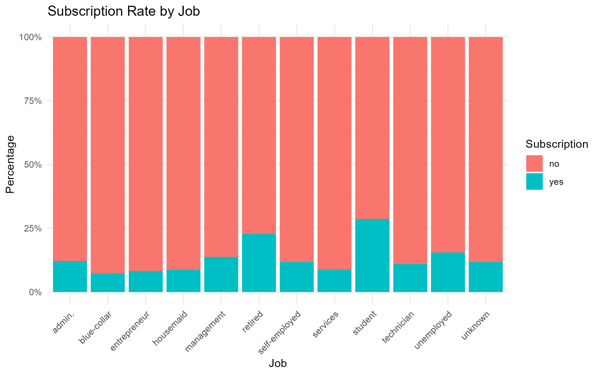
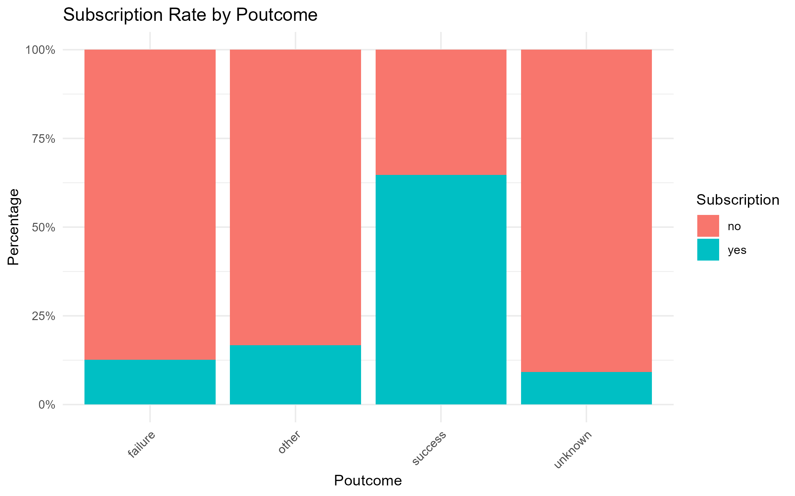
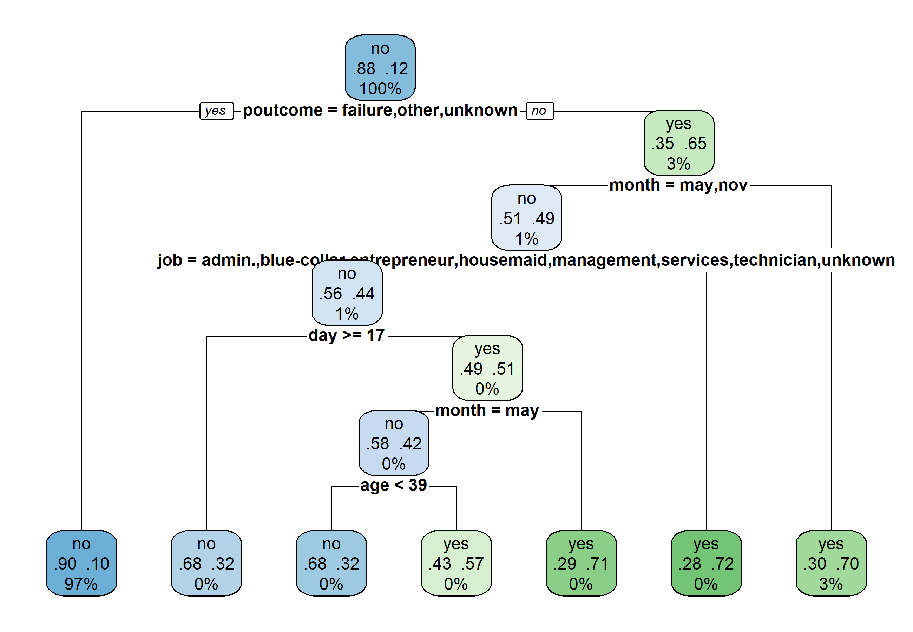
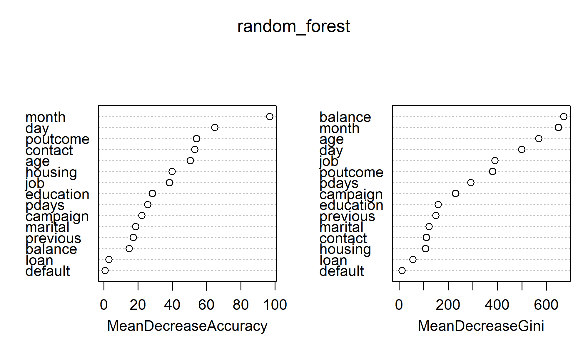

# NovaBank Term Deposit Subscription Prediction

## Project Overview

A machine learning project developed as part of the Quantic Master of Science in Business Analytics program to predict whether bank customers are likely to subscribe to a term deposit.

The project applies an end-to-end analytics workflow, from data preparation and exploratory analysis through feature engineering, predictive modeling, model evaluation, and business recommendations.

The objective is to help NovaBank identify customers who are more likely to respond positively to marketing campaigns, enabling more targeted and potentially more efficient customer outreach.

---

## Business Problem

NovaBank conducts marketing campaigns to encourage customers to subscribe to term deposit products. However, contacting customers who are unlikely to subscribe can increase campaign costs and reduce marketing efficiency.

The business question addressed in this project is:

> **Can customer and previous campaign characteristics be used to predict whether a customer will subscribe to a term deposit?**

A predictive model can help NovaBank prioritize customers with a higher likelihood of subscription.

---

## Analytical Approach

The project follows an end-to-end data analytics and machine learning workflow:

1. **Data Understanding**
   - Examined dataset structure and variables
   - Assessed the target variable and class distribution
   - Investigated data quality and potential outliers

2. **Data Cleaning**
   - Prepared variables for analysis
   - Addressed data quality issues
   - Created a cleaned analytical dataset

3. **Exploratory Data Analysis**
   - Investigated customer demographics
   - Examined financial characteristics
   - Analyzed previous marketing campaign outcomes
   - Explored relationships between customer characteristics and subscription behavior

4. **Feature Engineering**
   - Selected relevant predictors
   - Transformed variables for modeling
   - Prepared the final modeling dataset

5. **Predictive Modeling**
   
   Three classification algorithms were evaluated:
   - Logistic Regression
   - Decision Tree
   - Random Forest

6. **Model Evaluation**
   - Compared model performance using classification metrics
   - Evaluated the models with particular attention to their ability to identify customers who subscribe
   - Selected the most appropriate model for the business problem

---

## Key Visualizations

### Customer Subscription Distribution



### Correlation Analysis



### Subscription Rate by Job



### Subscription Rate by Previous Campaign Outcome



---

## Model Outputs

### Pruned Decision Tree



### Random Forest Variable Importance



---

## Machine Learning Models

Three classification models were evaluated:

| Model | Purpose |
|---|---|
| Logistic Regression | Interpretable baseline classification model |
| Decision Tree | Captures nonlinear relationships and provides interpretable decision rules |
| Random Forest | Ensemble model designed to improve predictive performance and capture complex relationships |

### Model Performance

The models were evaluated using accuracy, sensitivity, specificity, balanced accuracy, and Cohen's Kappa on the validation dataset.

| Metric | Logistic Regression | Decision Tree | Random Forest |
|---|---:|---:|---:|
| Accuracy | 89.25% | 88.95% | **89.49%** |
| Sensitivity (Yes) | 17.01% | **24.01%** | 23.25% |
| Specificity (No) | **98.82%** | 97.56% | 98.27% |
| Balanced Accuracy | 57.92% | **60.78%** | 60.76% |
| Kappa | 0.2334 | 0.2874 | **0.2974** |

### Model Selection

Random Forest delivered the strongest overall predictive performance, achieving the highest accuracy (89.49%) and Kappa (0.2974). It was therefore selected as the recommended model for customer targeting.

While the Decision Tree achieved slightly higher sensitivity and balanced accuracy, Random Forest provided the strongest overall performance across the evaluation metrics.

## Business Recommendations

The analysis can support NovaBank in developing a more targeted marketing strategy by:

- Prioritizing customers with a higher predicted probability of subscription
- Using previous campaign outcomes to inform future targeting
- Segmenting customers based on relevant demographic and behavioral characteristics
- Reducing resources spent contacting customers with a lower likelihood of conversion
- Continuously evaluating model performance as new campaign data becomes available

---

## Tools & Technologies

**Programming & Analysis**
- R
- RStudio

**Machine Learning**
- Logistic Regression
- Decision Trees
- Random Forest

**Data Analysis**
- Data Cleaning
- Exploratory Data Analysis
- Feature Engineering
- Classification
- Model Evaluation

**Documentation**
- R Markdown
- GitHub

---

## Project Structure

```text
NovaBank-Term-Deposit-Prediction/
│
├── data/
│   ├── raw/
│   ├── cleaned/
│   └── processed/
│
├── outputs/
│   ├── figures/
│   └── model_outputs/
│
├── scripts/
│   ├── Data Understanding.R
│   ├── Data Cleaning.R
│   ├── Exploratory Data Analysis.R
│   ├── Feature Engineering.R
│   └── Predictive Modeling.R
│
├── NovaBank_Notebook.Rmd
├── NovaBank_Churn_Project.Rproj
├── README.md
└── .gitignore
